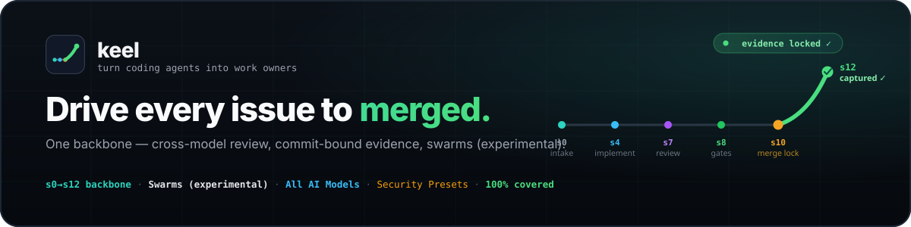

<picture>
  <source media="(prefers-color-scheme: light)" srcset="docs/assets/hero-light.svg">
  <source media="(prefers-color-scheme: dark)" srcset="docs/assets/hero.svg">
  
</picture>

# keel ⚓

[](https://github.com/berkayturanci/keel/actions/workflows/ci.yml)
[](https://berkayturanci.github.io/keel/coverage/)
[](https://github.com/berkayturanci/keel/actions/workflows/codeql.yml)
[](https://pypi.org/project/keel-workflow/)
[](https://pypi.org/project/keel-workflow/)
[](LICENSE)

> **keel** is a project-neutral, multi-agent **workflow core**. A *fixed backbone*
> of steps drives a unit of work — a GitHub issue — from backlog to done
> (branch → implement → CI → review → test → merge → close). Projects never fork the
> backbone: they set per-project **values** in `project.yaml` and snap their own
> **Lego pieces** into named extension slots.

The keel is a ship's backbone — the fixed spine every project builds on. The flagship
command is `keel:ship`; keel is where ships are built.

> Formerly **`ai-infra`** (a one-way file-copy sync of "portable" commands). keel replaces
> that with a thin-consumer model: the core is installed + pinned, never copied, so the
> drift/overwrite class of bug is structurally gone. Background:
> [`docs/proposals/divergence-audit-2035.md`](docs/proposals/divergence-audit-2035.md),
> [`docs/proposals/keel-architecture.md`](docs/proposals/keel-architecture.md).

## Three layers

```
Layer 3  EXTENSIONS   project-owned Lego pieces, ADD-ONLY into named slots
Layer 2  CONFIG       project.yaml — per-project values (branch, build cmd, globs, agents…)
Layer 1  BACKBONE     keel-core — fixed ordered step machine + invariants (this package)
```

Changing the backbone is a keel-core change. Projects only ever touch layers 2–3.

### What you get

- **One backbone, every agent** — install once; `/keel:<command>` runs as native Claude commands
  *and* as a single shared skill set every other agent (Codex, Antigravity, Gemini) reads.
- **Project Lego + policy packs** — snap gates/steps into named hooks (`guard`, `tester`,
  `pre-merge`, …) and keep labels, path policy, health sources, local commands, and
  workflow preferences in `policy_pack` data instead of packaged command prose.
- **Opt-in `jury` gate** — runs the [ai-jury](https://github.com/berkayturanci/ai-jury) multi-agent
  reviewer on the diff when installed; a fail-soft no-op otherwise.
- **Safe merges by construction** — timezone-aware night no-merge window, `mkdir` merge lock,
  risk-tier → reviewer count, hotfix bypass with an audit line, vendor+model attribution.

### The backbone

| step | name | primary hooks | |
|---|---|---|---|
| s0 | config | `after:config` | |
| s1 | select | `before:select`, `select`, `after:select` | |
| s2 | branch | `before:branch`, `after:branch` | |
| s3 | guard | `guard` | |
| s4 | implement | `before:implement`, `after-implement` | agent |
| s5 | classify | `classify`, `after:classify` | agent |
| s6 | ci | `before:ci`, `after:ci` | |
| s7 | review | `reviewers`, `after:review` | agent |
| s8 | test | `tester`, `test`, `after:test` | |
| s9 | fixloop | `before:fixloop`, `fixloop`, `after:fixloop` | |
| s10 | merge | `pre-merge`, `after:merge` | |
| s11 | capture | `capture`, `post-merge` | |
| s12 | close | `before:close`, `on-close`, `after:close` | |

Invariants the backbone always preserves: merge lock, night no-merge window, fail-soft,
orchestrator-only-writes, vendor+model attribution.

## Install

keel is a Python (≥3.11) package with one runtime dependency (PyYAML):

```bash
pip install keel-workflow                                     # from PyPI (provides the `keel` command)
pip install "git+https://github.com/berkayturanci/keel@v0.7.0"  # or pin an existing git tag
```

In a cloud agent session, install it from a `SessionStart` hook (or add keel to the
session's repo scope) so the selected core ref is available before a run.

Release maintainers should follow [`docs/keel/release.md`](docs/keel/release.md) and run
`python scripts/release_smoke.py` before tagging or announcing a package.

## Quickstart

```bash
keel setup --root .                                  # add keel config + adapters to a project
keel validate projects/example-flutter.yaml          # validate a config against the schema
keel plan      projects/example-flutter.yaml          # show the backbone plan for a project
keel version
```

`keel setup` wraps first-run onboarding (`init` + `install-adapter` + strict `validate` +
`plan`) for a consumer project. `keel plan` renders the fixed backbone with each project's
gates/extensions slotted in — exactly what a dry-run executes:

```
keel plan — example-flutter
  base_branch: main   core_version: ^0.6
  backbone:
     s4  implement  [agent]
     ...
     s8  test
           - gate: build
           - gate: lint
           - gate: design-parity
    s10  merge
           - gate: design-parity-gate
```

## Invocation (`/keel:<command>`)

The agentic workflows ship **with the package** as project-neutral adapters and install into
the **two surfaces** agents actually read — so the same `/keel:<command>` works in every
project; only that project's `.keel/project.yaml` + extensions change the behaviour:

```bash
keel install-adapter claude   # native Claude commands → /keel:ship, /keel:regression, …
keel install-adapter skills   # one shared keel-<cmd> skill set under .agents/skills/
#                               (read by every non-Claude agent: Codex, Antigravity, Gemini)
keel install-adapter all      # both surfaces
```

**16 shipped commands** — `ship` (flagship), `ship-v2`, `implement`, `review-cycle`,
`review-all-day`, `pr-loop`, `regression`, `triage`, `morning`, `overnight`, `wrap`,
`ci-check`, `coverage`, `deps-audit`, `flake-audit`, `stale-prs`. Each is described in
[`docs/keel/commands.md`](docs/keel/commands.md). The `keel` CLI does the deterministic work;
the adapters are the agentic flows (per-round review, inline comments, delegation).

## Dogfooding

keel drives **itself**: its config is `projects/keel.yaml` (Python, `make test` + `make lint`
gates) and CI runs keel on keel-core on every push —

```bash
keel plan      projects/keel.yaml          # render keel's own backbone
keel run-gates projects/keel.yaml --root . # keel runs its own test + lint gates
keel ship      projects/keel.yaml --root . # full dry assessment: tier, window, gates, decision
#   risk tier     : TIER-3  → 3 reviewer(s)
#   decision      : MERGE — clear to merge
```

If a step's gate fails, keel blocks its own merge — the same backbone every consumer gets.

## Docs

- 🌐 **Website + live coverage report** — `make site` builds the coverage HTML into
  `website/coverage/` and serves the site at <http://localhost:8000>. (Publishing to GitHub
  Pages is available via the manual `pages.yml` workflow once Pages is enabled.)
- [`docs/keel/configuration.md`](docs/keel/configuration.md) — `project.yaml` reference
- [`docs/keel/onboarding.md`](docs/keel/onboarding.md) — one-command consumer setup and follow-up checks
- [`docs/keel/extensions.md`](docs/keel/extensions.md) — authoring Lego extensions
- [`docs/keel/consumer-neutrality.md`](docs/keel/consumer-neutrality.md) — core vs project policy boundary
- [`docs/keel/parity-matrix.md`](docs/keel/parity-matrix.md) — legacy-to-keel command parity status and owning issues
- [`docs/keel/runtime-capabilities.md`](docs/keel/runtime-capabilities.md) — runtime capability detection and requirement declarations
- [`docs/keel/github-transport.md`](docs/keel/github-transport.md) — GitHub transport selection and normalized operation capabilities
- [`docs/keel/command-contracts.md`](docs/keel/command-contracts.md) — structured JSON plan/result contracts for adapters
- [`docs/keel/operator-consent.md`](docs/keel/operator-consent.md) — live-run operator consent scopes and delegated-agent scope rules
- [`docs/keel/cli.md`](docs/keel/cli.md) — CLI reference
- [`docs/keel/commands.md`](docs/keel/commands.md) — the 16 `/keel:<command>` workflows, each with its description
- [`docs/keel/cutover.md`](docs/keel/cutover.md) — staged guide to retire a project's copied command bodies (install → verify → retire), losing nothing
- [`docs/keel/comparison.md`](docs/keel/comparison.md) — competitive landscape (Mergify, GitHub merge queue, Qodo/PR-Agent, CodeRabbit, Sweep, OpenHands, Danger, …) + ranked borrow-ideas
- [`docs/keel/github-actions.md`](docs/keel/github-actions.md) — run keel live on GitHub's free runner (the `keel-ship` workflow)
- [`docs/keel/release.md`](docs/keel/release.md) — PyPI/TestPyPI release runbook and package smoke test
- [`docs/proposals/keel-architecture.md`](docs/proposals/keel-architecture.md) — full design

## Development

Stdlib-first, pure-core + thin-I/O, deterministic, fully covered (ai-jury ethos).

```bash
make test       # offline unit suite (no network, no credentials)
make lint       # ruff
make coverage   # coverage gate (fail_under in pyproject)
make validate   # validate every projects/*.yaml
make site       # build the coverage report + serve the website at localhost:8000
```

The pure core (`config`, `model`, `extensions`, `findings`, `gates`, `orchestrator`,
`cli`) is held at **100% line + branch coverage**; the coverage gate (`fail_under = 100`)
runs in CI.

## Repo layout

```
src/keel/            the core package (config, model, extensions, findings, gates, orchestrator, cli)
src/keel/schema/     project.schema.json (bundled)
projects/*.yaml      example configs (example-android, example-flutter, keel)
src/keel/adapters/   the packaged /keel:<command> bodies (install-adapter: claude commands + shared skills)
adapters/            reference adapter (claude/keel-ship.md) + the adapter model (README)
website/             static site + coverage report (make site)
tests/               unit suite
docs/                docs + proposals
```
