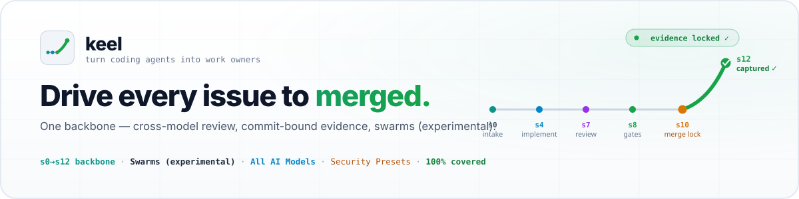

<picture>
  <source media="(prefers-color-scheme: dark)" srcset="docs/assets/hero.svg">
  <source media="(prefers-color-scheme: light)" srcset="docs/assets/hero-light.svg">
  
</picture>

# keel ⚓

[](https://github.com/berkayturanci/keel/actions/workflows/ci.yml)
[](https://keel-ship.dev/coverage/)
[](https://github.com/berkayturanci/keel/actions/workflows/codeql.yml)
[](https://pypi.org/project/keel-workflow/)
[](https://pypi.org/project/keel-workflow/)
[](LICENSE)

> **Keel turns coding agents into work owners.** keel is a project-neutral workflow
> backbone that takes one GitHub issue from intake to a merged pull request, or stops it
> at a named step with the reason recorded.

**How a run happens**

1. **Your agent host does the work.** In Claude Code, Codex, Cursor (partial) or Antigravity you run
   `/keel:ship <issue>`; the agent writes the code, opens the pull request and dispatches
   the reviewers.
2. **keel's CLI enforces the backbone.** At each of the fixed steps `s0`–`s12` the agent asks
   `keel` for the plan, the gates, the reviewers and the evidence it owes. `keel ship` is a dry
   assessment: the agent commits, pushes and opens the pull request. The CLI's own writes are
   these. On GitHub: the merge `keel merge` makes, the lesson commit `keel capture-land` pushes
   onto the pull request's branch (the base branch without `--onto`), the verdict and closure
   comments `keel post-comment` and `keel review --live` post or update, the labels
   `keel doctor --fix` creates, and the branch and pull request per cluster that the experimental
   `keel swarm-run --live` pushes and opens, and `keel swarm-land --live` merges each such pull
   request through `keel merge`. Locally: `keel worktree-remove` removes a
   worktree, `keel swarm-status --clean` removes what swarm runs left behind, `keel rollback` (or `keel canary --auto-revert`) commits a revert, and the opt-in
   `revert-check` gate has `keel run-gates` and `keel ship` add and remove a temp worktree.
3. **A pull request merges only through `keel merge`**, which takes the merge lock,
   re-checks the merge window, reads the live CI rollup and verifies the head-pinned review
   evidence first.

<br><sub>A real recording: [`scripts/record_demo.py`](scripts/record_demo.py) runs this repository's keel in a scratch repository and regenerates it, and `tests/test_readme_demo.py` fails if it drifts from what keel prints.</sub>

## Built for long unattended runs

| Practice for long agent runs | What keel does |
|---|---|
| Define "done" first | An issue with no deliverable or no acceptance criteria comes back `needs-input` with questions, and `/keel:ship` stops before it cuts a branch (`intake.py`, ship Step 0) |
| Name the stops | A live run declares its consent scopes (`filesystem`, `git`, `github`, …) before it acts; merges go only through `keel merge`, inside the merge window (an audited `--hotfix` is the one bypass) |
| Keep state in a file | A resumable checkpoint (`keel checkpoint`, `keel resume`) and an append-only run ledger (`.keel/state/run-ledger.jsonl`) |
| Fan out, then check | `/keel:regression` runs parallel reviewers and keeps low-confidence findings as review-only instead of filing them |
| Review before a person does | Review verdicts are pinned to the head SHA; reviewers can run on another vendor, and `knobs.evidence_require_distinct_vendors` makes distinct reviewer vendors a requirement |
| Read what's blocked first | `/keel:morning` puts the cross-session deferrals at the top of the briefing |

These map to the long-run advice in Anthropic's
[*Getting the most out of Opus 5.5*](https://claude.dev/blog/getting-the-most-out-of-opus-5-5/)
guide; they hold for any agent. keel is independent and not affiliated with Anthropic.

Why the merge gets its own checks:
[a squash merge silently reverted our release, and CI stayed green](https://keel-ship.dev/silent-revert.html).

## Install

### Homebrew (macOS & Linux)
```bash
brew tap berkayturanci/keel
brew install keel
```

Or install in a single command:
```bash
brew install berkayturanci/keel/keel
```

### Standalone Curl Installer (macOS, Linux, WSL)
```bash
curl -fsSL https://raw.githubusercontent.com/berkayturanci/keel/main/scripts/install.sh | sh
```

### PyPI / pipx / uv
```bash
pipx install keel-workflow                                    # isolated global CLI tool
uv tool install keel-workflow                                 # the same, with uv
pip install keel-workflow                                     # from PyPI (provides the `keel` command)
pip install "git+https://github.com/berkayturanci/keel@v1.25.0"  # or pin an existing git tag
```

In a cloud agent session, install it from a `SessionStart` hook (or add keel to the
session's repo scope) so the selected core ref is available before a run.

`keel setup` (below) writes the workflows into your project for Claude Code and for agents
that read `.agents/skills/`. To install keel into an agent as a plugin instead, see
[Install into an agent](#install-into-an-agent).

## Quickstart

In a git repository whose issues live on GitHub:

```bash
keel setup --root .                          # add keel config + adapters to this project
keel validate .keel/project.yaml --root .    # validate the config setup just wrote
keel run-gates .keel/project.yaml --root .   # run the build gate once
```

`keel setup` detects the stack and writes `.keel/project.yaml`, the `/keel:<command>`
files under `.claude/commands/keel/`, and the matching `keel-<command>` skills under
`.agents/skills/`. With `--wizard` it also asks who implements and who reviews; on a project
that is already set up, `--force` re-runs it and overwrites `.keel/project.yaml`.

**If setup prints `build gate   : not configured`**, it found no stack and no Makefile `test`
rule, so it wrote no build command rather than guess one
([#1328](https://github.com/berkayturanci/keel/issues/1328)); a Makefile with a `test` rule
gets `make test`. Until you set one, `run-gates` fails the `build` gate with
`no build gate configured: set knobs.build_gate_cmd …` and every run blocks on it. Replace
`knobs: {}` in `.keel/project.yaml` with your project's own test command and run the gates
again:

```yaml
knobs:
  build_gate_cmd: "python3 -m unittest"   # your project's test command
```

Then ask keel for a dry assessment. It changes nothing:

```bash
keel plan  .keel/project.yaml --root .       # the backbone, with this project's gates slotted in
keel ship  .keel/project.yaml --root .       # risk tier, reviewers, merge window, gates, decision
keel doctor .keel/project.yaml --root .      # versions, adapters, gh auth and agent hosts
```

```text
keel ship — my-project  (base main)
  …
  risk tier     : TIER-2  → 2 reviewer(s)
  …
  jury          : off (default)
  merge window  : OPEN
  …
  gate build          ok
  decision      : MERGE — clear to merge
  note: dry assessment; live merge (s10) needs a configured runner (git + gh auth).
```

**Your first issue.** keel's intake needs two sections besides the title: a deliverable
(`## Deliverable`, or `Scope`, `Proposal`, `Proposed direction`, `Implementation`) and
acceptance criteria as a bulleted list (`## Acceptance criteria`, or `Acceptance`,
`Definition of done`, `Done when`, `DoD`). The objective is an `## Objective`, `Problem`,
`Summary` or `Context` section when there is one, and the title otherwise. Then open the repository in
your agent host and run `/keel:ship <issue-number>`, or the `keel-ship` skill on a host that
reads skills. What you will see:

1. The agent stops once and asks you to approve the run's consent scopes (`filesystem`,
   `git`, `github`): `keel setup` writes `consent_mode: "explicit"`.
2. If the issue has no deliverable or no acceptance criteria, or reads as undecided (`TBD`,
   `unclear`, `not sure`, …), the agent posts keel's questions and stops before it cuts a
   branch.
3. Otherwise it works in its own git worktree, opens a pull request, waits on CI and gets
   reviewed (two reviewers at TIER-2 by default), then runs the gates.
4. The run ends in one of two ways: `keel merge` merges the pull request and the issue is
   closed, or the run stops at a named step and says why. A stopped run resumes from its
   checkpoint.

With no `timezone` and `merge_window` set, the merge window is always open; set both to keep
merges out of the night. The one-command setup and what to check afterwards are in
[`docs/keel/onboarding.md`](docs/keel/onboarding.md).

## Requirements, cost and limits

### Requirements

- **Python 3.11 or newer**, and `git`.
- **An authenticated `gh`** (`gh auth login`) for a live run. Every GitHub call the CLI
  makes goes through `gh`: `keel merge`, `keel evidence-verify`, `keel post-comment` and the
  CI rollup all need it.
- **Something to implement.** An agent host to follow `/keel:ship`: Claude Code, Codex,
  Antigravity, or Cursor (partial, [#1332](https://github.com/berkayturanci/keel/issues/1332)).
  The implement and review seats it dispatches can be the host itself, another agent CLI,
  or a hosted-API delegate (`--delegate anthropic-api:MODEL`, `openai-api:MODEL`,
  `google-api:MODEL`) that needs only that provider's API key.
- **For tier-3 changes:** [ai-jury](https://github.com/berkayturanci/ai-jury), or `--no-jury`.
  Without the `jury` binary the s8 run is a no-op (reported `SKIPPED`; with no other gate planned it blocks), but a tier-3 merge still requires a
  `jury-verdict` unless the run passes `--no-jury`; it relaxes to advisory only when a posted
  verdict (or `--jury-vendors`) reports fewer than 2 vendors. That is the default policy: off a
  jury-panel tier, `team.jury.mode: advisory` or `--jury-advisory` never requires the verdict and
  `team.jury.min_vendors` may raise the 2; on a tier whose review is the jury panel, no flag or
  short panel relaxes it, and only a probe that finds the panel unstaffable turns that tier's
  jury off, under `team.jury.on_unavailable: fallback` (the default).

The dry commands in the Quickstart need only Python and git.

### Cost

keel adds no model usage beyond the seats a run dispatches, and those are billed by your agent
host's plan or by the API provider behind a delegate. Per issue that is the implementer, a
gate review when `knobs.team.gate` names one, one to three reviewers by risk tier (TIER-1 → 1,
TIER-2 → 2, TIER-3 → 3, unless `knobs.team` names the seats), any fix-loop rounds, and at
tier 3 the ai-jury panel.

`keel cost-report --root .` summarises the records under `.keel/activity`. The only token
counts keel records are the ones a hosted-API delegate (`anthropic-api`, `openai-api`,
`google-api`, or an OpenAI-compatible profile) reports in its response, and only when the
adapter runs it as `keel delegate run --activity-run-id <run>`. An agent host's own tokens
and a CLI delegate's are never recorded. A record with no counts is priced at a placeholder
of 1,500 prompt and 400 completion tokens, so read a report built from those as a count of
runs, not as a bill. The report says which it is: its `Token Basis` line reads `ESTIMATED at
1,500 prompt / 400 completion tokens per run` when no record carries counts, and `--json`
carries `token_basis`, `measured_runs`, `estimated_runs` and `assumed_tokens_per_run`. The
dollar figures are keel's own pricing table applied to those counts, never the provider's
bill.

### Limits

- **GitHub only.** Issues, pull requests, CI rollups and merges live on GitHub. The CLI
  reaches it through `gh` alone; the `mcp` transport describes what an agent host's own
  GitHub MCP server can do for its reads and comments, and marks merges and check rollups
  as degraded there ([transport](docs/keel/github-transport.md)).
- **Swarm is experimental.** `/keel:swarm` plans waves, and `swarm-run --live` now has each
  cluster's implementer seat write the change and opens one pull request per cluster, but those
  pull requests carry no review evidence, and nothing in the swarm reviews them; `swarm-land`
  merges them through `keel merge` only once their review is recorded
  ([#1400](https://github.com/berkayturanci/keel/issues/1400),
  [#1287](https://github.com/berkayturanci/keel/issues/1287)). Use `/keel:ship` for work you
  need merged.
- **The unit is the issue.** keel has no channel for steering a run in flight: to change
  direction, change the issue. A run that stops resumes from its checkpoint (`keel resume`).
- **Consent is emit-only in core.** keel emits the consent contract and the gate-review seat;
  the agent host is what honours them ([operator consent](docs/keel/operator-consent.md)).

### Uninstall

Remove the CLI the way you installed it:

```bash
brew uninstall keel                  # Homebrew
pipx uninstall keel-workflow         # pipx
uv tool uninstall keel-workflow      # uv
pip uninstall keel-workflow          # pip
```

The curl installer uses pipx or uv when it finds them; otherwise it installs into
`~/.local/share/keel` and links `~/.local/bin/keel`, and removing those two paths removes it.

Then remove what `keel setup` wrote into a project: `.keel/`, `.claude/commands/keel/` and
`.agents/skills/keel-*/`. A plugin comes out with its host's own command:
`claude plugin uninstall keel@keel`, `codex plugin remove keel@keel`,
`agy plugin uninstall keel`. A Cursor local checkout is the directory
`~/.cursor/plugins/local/keel`.

## Install into an agent

Everything above needs the **CLI on your machine** — [Install](#install) puts it
there, and `keel setup` / `keel install-adapter` write files into a project with it.
Installing keel as a **plugin** is how an agent gets the commands and skills: from this
repository's own marketplace, with no `install-adapter` step. It is **not** a
replacement for the CLI — the command bodies shell out to `keel`, so it still has
to be on your `PATH`. Jump to the agent you use:

[](#claude-code)
[](#codex)
[](#antigravity)
[](#cursor)

Each badge jumps to that agent's box; open it for the commands. (A browser scrolls
to a collapsed `<details>`; it does not expand one.)

<a id="claude-code"></a>
<details>
<summary><b>Claude Code</b> — marketplace plugin</summary>

**Install**

```bash
claude plugin marketplace add https://github.com/berkayturanci/keel
claude plugin install keel@keel
```

In a running session: `/plugin marketplace add berkayturanci/keel` then
`/plugin install keel`.

**Update**

```bash
claude plugin marketplace update keel
claude plugin update keel@keel
```

`claude plugin install` is a **no-op** on an already-installed plugin, so it is
not an upgrade path. `plugin update` needs the qualified `name@marketplace`: the
bare name exits 1 with `Plugin "keel" not found`.

</details>

<a id="codex"></a>
<details>
<summary><b>Codex</b> — marketplace plugin</summary>

**Install**

```bash
codex plugin marketplace add https://github.com/berkayturanci/keel
codex plugin add keel@keel
```

**Update**

```bash
codex plugin marketplace upgrade
codex plugin add keel@keel
```

`AGENTS.md` is read by Codex with no plugin at all, which is what makes the plain
CLI route useful in a container.

</details>

<a id="antigravity"></a>
<details>
<summary><b>Antigravity</b> (<code>agy</code>) — git install</summary>

**Install**

```bash
agy plugin install https://github.com/berkayturanci/keel
agy plugin enable keel
```

`install` alone leaves it **disabled**.

**Update**

```bash
agy plugin install https://github.com/berkayturanci/keel
```

Overwrites in place, keeps the enabled flag. agy discovers components by
**root-directory convention only** — keel's root `skills/` and `commands/` — and
`agy plugin list` reports what was imported rather than what is on disk, so
re-run the install after a release that adds a component directory.

</details>

<a id="cursor"></a>
<details>
<summary><b>Cursor</b> — partial: two routes, and they differ</summary>

**Partial** ([#1332](https://github.com/berkayturanci/keel/issues/1332)). The marketplace
route registers the `/keel:<command>` set. A local checkout registers one skill,
`keel-onboard`: `.cursor-plugin/plugin.json` names `./skills`, and the workflow skills
live in `.agents/skills/`, which no manifest names. Whether Cursor registers them when
the manifest names `.agents/skills` too is not verified in a running Cursor.

Cursor has **no CLI install command** — `cursor-agent plugin` exposes only
`marketplace` — and the two routes do not register the same things.

**Install — marketplace** (registers the `/keel:` commands)

```bash
cursor-agent plugin marketplace add https://github.com/berkayturanci/keel
```

Then install it from Cursor's `/plugins` screen.

**Install — local checkout** (skills only, but its update is a `git pull`)

```bash
git clone --depth 1 https://github.com/berkayturanci/keel ~/.cursor/plugins/local/keel
```

Then restart Cursor. It is *reported* to list as `keel (Local)` under
**Settings → Plugins**. Not verified: that is a GUI listing, and only the CLI was checked.

**Update**

Whichever route you took — they are alternatives, not steps:

```bash
git -C ~/.cursor/plugins/local/keel pull                   # if you cloned
```

```bash
cursor-agent plugin marketplace update berkayturanci/keel  # if you used the marketplace
```

Restart Cursor either way. The second re-indexes the **marketplace** — Cursor's
own words — which is not the same as moving an installed plugin forward. Not
verified: whether it also updates an installed plugin. The two routes trade off: marketplace
registers the commands, the local checkout has an update that is a `git pull`.

A locally installed Cursor plugin registers **skills only — and here that is one
skill.** `.cursor-plugin/plugin.json` names `./skills`, and the repository root's
`skills/` holds `keel-onboard` alone; the 17 workflow skills live in
`.agents/skills/`, which no plugin manifest points at. keel's 17
`/keel:<command>` entries, where they appear in Cursor, are being read out of
Claude Code's plugin cache — pinned to whichever version directory Claude kept.
The marketplace route is the one that registers commands.

</details>

Full detail, including what each route actually registers:
[`docs/keel/install.md`](docs/keel/install.md).

The plugin ships the same project-neutral command bodies as `keel install-adapter`; the two
flows are additive. The plugin's command files under `commands/` are generated from
`src/keel/adapters/commands/` (the single source of truth) by `make plugin` /
`keel install-adapter plugin`, and a test fails on any drift. The `pip install keel-workflow`
+ `keel install-adapter` path is unchanged.

## What you get

Each line links to the full description in [`docs/keel/overview.md`](docs/keel/overview.md#what-you-get)
or the reference it points at.

- **One backbone, four hosts** — keel installs into Claude Code, Codex, Cursor (partial,
  [#1332](https://github.com/berkayturanci/keel/issues/1332)) and Antigravity
  ([per-host steps](docs/keel/install.md)).
- **A team, not a delegate** — `knobs.team` names who implements, who gives the gate review,
  who reviews at each risk tier, and who applies the findings
  ([reference](docs/keel/configuration.md#team)).
- **A cross-vendor jury, on automatically at tier 3** — a change matching `knobs.tier3_globs`
  turns on the [ai-jury](https://github.com/berkayturanci/ai-jury) panel, and the evidence gate
  then requires its verdict. Below tier 3 it is off unless a run passes `--jury` or
  `knobs.team` makes the panel the review; `--no-jury` turns it off below a panel tier, and
  listing `jury` in `gates:` also runs it at s8. Without the `jury` binary the s8 run is a
  no-op (reported `SKIPPED`; with no other gate planned it blocks), but a tier-3 merge still requires a `jury-verdict` unless the run passes `--no-jury`;
  it relaxes to advisory only when a posted verdict (or `--jury-vendors`) reports fewer than
  2 vendors. That is the default policy: off a jury-panel tier, `team.jury.mode: advisory` or
  `--jury-advisory` never requires the verdict and `team.jury.min_vendors` may raise the 2; on a
  tier whose review is the jury panel, no flag or short panel relaxes it, and only a probe that
  finds the panel unstaffable turns that tier's jury off, under
  `team.jury.on_unavailable: fallback` (the default)
  ([details](docs/keel/overview.md#what-you-get)).
- **Safe merges** — `keel merge` claims the lock, re-checks the window, reads the live CI
  rollup and verifies the evidence before it merges, over GraphQL or REST
  ([reference](docs/keel/cli.md#keel-merge-projectyaml---pr-n---root-dir---method-squashmergerebase---transport-autographqlrest---dry-run---effort-lowmediumhigh---team-profile)).
- **An auditable evidence chain** — review verdicts, test results and model attribution,
  bound to the commit SHA ([guide](docs/keel/evidence.md)).
- **Test-first and gate-judged loops** — `knobs.implement_mode: tdd` verifies that tests
  landed first, and `knobs.loop` iterates s4 until the gates are green
  ([tdd](docs/keel/configuration.md#implement_mode), [loop](docs/keel/configuration.md#loop)).
- **A lesson from every merge** — a capture sink writes one Markdown learning per merge and
  reads matching ones back into later briefs
  ([reference](docs/keel/configuration.md#policy_packcapturelearningsink)).
- **Headless with an API key** — hosted-API and OpenAI-compatible delegates, local models,
  and `keel doctor --providers` to see what this machine can reach
  ([models](docs/keel/models.md)).
- **Project Lego, policy packs and security presets** — add-only hooks, `policy_pack` data,
  and `bandit` / `gitleaks` / `semgrep` / `trivy` presets ([extensions](docs/keel/extensions.md)).
- **Swarm (experimental)** — backlog waves in isolated worktrees; a live run implements each
  cluster and opens one pull request per cluster, which `swarm-land` merges through `keel merge`
  once its review verdicts are posted — nothing in the swarm reviews them, and no real landing
  has been exercised yet ([guide](docs/keel/swarm.md)).

How keel compares with coding agents, PR reviewers and merge queues:
[overview](docs/keel/overview.md#how-keel-compares) and
[`docs/keel/comparison.md`](docs/keel/comparison.md). Why keel exists:
[From "I opened a PR" to merged](docs/keel/overview.md#from-i-opened-a-pr-to-merged).

## Three layers

```
Layer 3  EXTENSIONS   project-owned Lego pieces, ADD-ONLY into named slots
Layer 2  CONFIG       project.yaml — per-project values (branch, build cmd, globs, agents…)
Layer 1  BACKBONE     keel-core — fixed ordered step machine + invariants (this package)
```

Changing the backbone is a keel-core change. Projects only ever touch layers 2–3. The
step-by-step backbone table and its invariants are in
[`docs/keel/overview.md`](docs/keel/overview.md#the-backbone). The original design proposal,
[`docs/proposals/keel-architecture.md`](docs/proposals/keel-architecture.md), is historical;
current behaviour is documented in [`docs/keel/`](docs/keel/).

## Invocation (`/keel:<command>`)

The agentic workflows ship **with the package** as project-neutral adapters and install into
the **two surfaces** agents actually read — so the same `/keel:<command>` works in every
project; only that project's `.keel/project.yaml` + extensions change the behaviour:

```bash
keel install-adapter claude   # native Claude commands → /keel:ship, /keel:regression, …
keel install-adapter skills   # one shared keel-<cmd> skill set under .agents/skills/
#                               (the shared surface for non-Claude hosts)
keel install-adapter all      # both surfaces
```

**17 shipped commands** — `ship` (flagship, with a `--compound` profile flag), `implement`,
`review-cycle`, `review-all-day`, `pr-loop`, `regression`, `triage`, `morning`, `work-block`,
`overnight`, `swarm`, `wrap`, `ci-check`, `coverage`, `deps-audit`, `flake-audit`, `stale-prs`.
Each is described in
[`docs/keel/commands.md`](docs/keel/commands.md). The `keel` CLI does the deterministic work;
the adapters are the agentic flows (per-round review, inline comments, delegation).

## Companion: keel-visual

[`keel-visual`](https://pypi.org/project/keel-visual/) is an **optional, separately
installable** animated run visualizer (`pipx install keel-visual`). It *renders* a
keel run from the ledger/checkpoint keel already writes — it never drives one — for
**any of the 17 command flows**, in the terminal (`play`, `dash`) or as a web page
(`render`, `serve`). The core never depends on it. See
[`docs/keel/keel-visual.md`](docs/keel/keel-visual.md) and
[its surfaces](docs/keel/overview.md#keel-visual).

## Docs

- 🌐 **[Website + live coverage report](https://keel-ship.dev/)** — the
  published site is live at <https://keel-ship.dev/> (deployed via the
  `pages.yml` workflow). Locally, `make site` builds the coverage HTML into
  `website/coverage/` and serves it at <http://localhost:8000>.
- [`docs/keel/overview.md`](docs/keel/overview.md) — why keel exists, the full feature list, the comparison table, the backbone table, dogfooding, and keel-visual
- [`docs/keel/configuration.md`](docs/keel/configuration.md) — `project.yaml` reference
- [`docs/keel/evidence.md`](docs/keel/evidence.md) — evidence chain, commit-SHA binding, and compliance auditability
- [`docs/keel/models.md`](docs/keel/models.md) — supported AI models, providers, and delegate profiles (Claude, OpenAI, Gemini, OpenRouter, DeepSeek, Groq, Ollama, CLI tools)
- [`docs/keel/parameter-reference.md`](docs/keel/parameter-reference.md) — exhaustive per-flag reference for every CLI command and the `/keel:ship` adapter arguments
- [`docs/keel/install.md`](docs/keel/install.md) — installing keel **into an agent** (Claude Code, Codex, Antigravity, Cursor (partial)), with the update path for each
- [`docs/keel/onboarding.md`](docs/keel/onboarding.md) — one-command consumer setup and follow-up checks
- [`docs/keel/keel-visual.md`](docs/keel/keel-visual.md) — the live run board (`dash`/`render`/`serve`, the per-run 2D/3D drawer, `--all` multi-project, the auto-stamped `keel activity` channel)
- [`docs/keel/extensions.md`](docs/keel/extensions.md) — authoring Lego extensions
- [`docs/keel/artifacts.md`](docs/keel/artifacts.md) — where runtime state and agent scratch live (the `.keel/` dir, its auto-scaffolded `.gitignore`, and `keel scratch-dir`)
- [`docs/keel/consumer-neutrality.md`](docs/keel/consumer-neutrality.md) — core vs project policy boundary
- [`docs/keel/parity-matrix.md`](docs/keel/parity-matrix.md) — legacy-to-keel command parity status and owning issues
- [`docs/keel/runtime-capabilities.md`](docs/keel/runtime-capabilities.md) — runtime capability detection and requirement declarations
- [`docs/keel/github-transport.md`](docs/keel/github-transport.md) — GitHub transport selection and normalized operation capabilities
- [`docs/keel/command-contracts.md`](docs/keel/command-contracts.md) — structured JSON plan/result contracts for adapters
- [`docs/keel/operator-consent.md`](docs/keel/operator-consent.md) — live-run operator consent scopes and delegated-agent scope rules
- [`docs/keel/cli.md`](docs/keel/cli.md) — CLI reference
- [`docs/keel/commands.md`](docs/keel/commands.md) — the 17 `/keel:<command>` workflows (plus the `keel status` progress command), each with its description
- [`docs/keel/swarm.md`](docs/keel/swarm.md) — multi-agent swarm architecture, dependency DAG wave scheduling, isolated worktrees, batch landing (each cluster's pull request merged through `keel merge`, one at a time), and the 2D/pseudo-3D snapshot visualizer
- [`docs/keel/cutover.md`](docs/keel/cutover.md) — staged guide to retire a project's copied command bodies (install → verify → retire), losing nothing
- [`docs/keel/comparison.md`](docs/keel/comparison.md) — competitive landscape (Mergify, GitHub merge queue, Qodo/PR-Agent, CodeRabbit, Sweep, OpenHands, Danger, …) + ranked borrow-ideas
- [`docs/keel/github-actions.md`](docs/keel/github-actions.md) — run keel live on GitHub's free runner (the `keel-ship` workflow)
- [`docs/keel/release.md`](docs/keel/release.md) — PyPI/TestPyPI release runbook and package smoke test
- [`docs/keel/homebrew-release-chain.md`](docs/keel/homebrew-release-chain.md) — how a release reaches `brew install`, every guard on the way, and what has already gone wrong
- [`docs/proposals/keel-architecture.md`](docs/proposals/keel-architecture.md) — the original design proposal (historical; current behaviour is in `docs/keel/`)
- [`docs/proposals/api-token-delegate.md`](docs/proposals/api-token-delegate.md) — hosted-API (API-token) implementer/reviewer delegate design (#548)

## Development

Stdlib-first, pure-core + thin-I/O, deterministic, fully covered (ai-jury ethos).

```bash
make test       # offline unit suite (no network, no credentials)
make lint       # ruff
make coverage   # coverage gate (fail_under in pyproject)
make validate   # validate projects/*.yaml and .keel/project.yaml
make site       # build the coverage report + serve the website at localhost:8000
```

Every module under `src/keel/` is held at **100% line + branch coverage**: the coverage gate
(`fail_under = 100`, run in CI) measures the whole `keel` package and omits only the
`python -m keel` entry shim, `src/keel/__main__.py`. keel drives itself from `.keel/project.yaml`
([dogfooding](docs/keel/overview.md#dogfooding)).

Release maintainers should follow [`docs/keel/release.md`](docs/keel/release.md) and run
`python scripts/release_smoke.py` before tagging or announcing a package.

## Repo layout

```
src/keel/            the core package (config, model, extensions, findings, gates, orchestrator, cli)
src/keel/schema/     project.schema.json (bundled)
.keel/project.yaml   keel's own dogfood consumer config
projects/*.yaml      example configs and the keel seed copy
src/keel/adapters/   the packaged /keel:<command> bodies (install-adapter: claude commands + shared skills)
keel-visual/         optional companion: animated 2D/3D run visualizer (separate package)
website/             static site + coverage report (make site)
tests/               unit suite
docs/                docs + proposals
```
