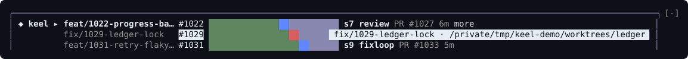
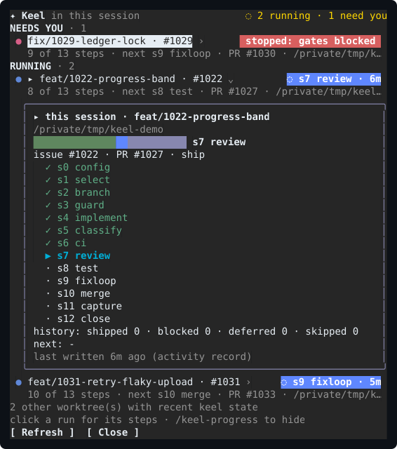

# keel-progress — the live run band for Claude Code

`keel-progress` is an **optional Claude Code mod** that shows this repository's live keel
runs inside Claude Code, so you do not need a second terminal running `keel-visual dash`.
It only reads: it never writes the checkpoint or ledger and never drives a run. The full
reference is [`mods/keel-progress/README.md`](../../mods/keel-progress/README.md).


## Install

Install keel first ([install.md](install.md)). You also need Claude Code **2.1.287 or
newer**, with mods enabled for your account. Then, in Claude Code:

```text
/plugin marketplace add berkayturanci/keel
/plugin install keel-progress@keel
```

Start Claude Code in the directory that holds `.keel/project.yaml`, with `keel` on your
`PATH`. Other hosts are not affected: only Claude Code's plugin loader reads the mod.

## What it shows

**The band.** A rounded card above the prompt, one row per live run (`active`, `waiting` or
`interrupted`). A row shows the issue, the backbone as a segmented step bar (done green, the
current step blue, or red where the run stopped, the rest grey), the current step, why the
run is held as a chip (amber while waiting, red when stopped), the pull request, and how
long since keel last wrote. A run whose phase is not a backbone step (a pr-loop, say) shows a one-step bar named
like `review (pr-loop)`. With more than one run each row starts with its branch. Nothing
is drawn when no run is live.

**Hover.** Point at a run for more, at the right end of its row. At the step bar you see how
far along it is and the next step; at a branch, the whole branch and its worktree. The run's
name also lights in the side panel. The terminal draws this on its own, so no hook runs as
the pointer moves.



**The side panel.** `/keel-progress` opens it, and closes it when it is open. It lists runs
under **NEEDS YOU** (stopped, or waiting for input) and **RUNNING**. Click a run to open it
in full: its branch and worktree, links to the PR and the issue, the step bar, every
backbone step, the history counts (shipped, blocked, deferred, skipped), the next queued
issue and when keel last wrote. For a run whose phase is not a backbone step (a pr-loop,
say), the card lists one step named like `review (pr-loop)` instead; the history counts and
the next issue come from the checkpoint of the run that won.



**Notifications.** A toast when a run stops, waits for you, or leaves the board (merged,
closed or finished). There are none for what was already there when the session opened.

## Whose runs

A session shows its own keel runs only: the ones in its folder and in the worktrees keel
made under it (`keel ship` puts a run's worktree inside the session's checkout). Other
sessions' runs are neither shown nor read. Turn on "Show other sessions' runs" in `/config`
to see every recently active worktree of the repository.

## How it reads state, and why that is cheap

keel records a run in two places, and the mod reads both:

- the checkpoint, read with `keel status --json`
- the activity record (`.keel/activity/<run-id>.json`), which is often newer than the
  checkpoint. It is read straight from its file; `keel activity --json` runs once, to learn
  where the records live

Of a run's live records (a running activity record, or an active, waiting or interrupted
checkpoint), the newest wins. An activity record that is done or merged is dropped, so it
never replaces an older live checkpoint. `keel status` runs only when a checkpoint
changed, or at most every 30 seconds while a run is live, and at once after a keel Bash
call, when the panel opens, or on Refresh; activity is read from its files. The mod scans
every two seconds while a run is live and five times less often (10 seconds at the default)
when none is, and right after any Bash call that runs `keel`. Only one scan runs at a time. The step names come from the
status contract (`keel.progress-status.v1`), so a renamed or added step shows up without a
mod release.

## Settings

Set these in `/config`, or with `/plugin configure keel-progress@keel`.

| Setting | Default | What it does |
| --- | --- | --- |
| Show other sessions' runs | off | Every recently active worktree of the repository, not only this session's own. |
| Refresh every (seconds) | 2 | How often keel's state is read while a run is live. |
| Runs above the prompt | 3 | How many runs the band shows before `+N more`. |
| Notifications | on | Toasts for a stopped run, a run waiting for you, a run that left. |
| Sound | off | A short sound with those toasts. |

## Limits

It shows one repository: the one the session runs in. A project created later in the
session (`keel init`) shows after `/reload-plugins` or a new session. The README lists the
rest.
