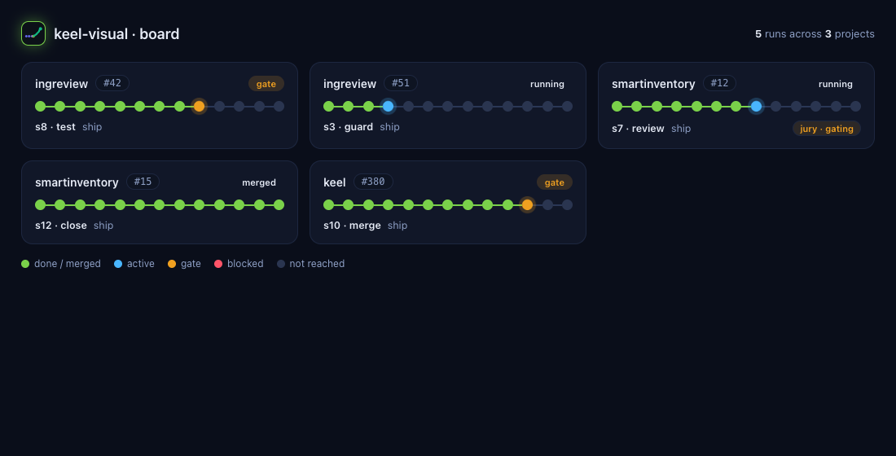
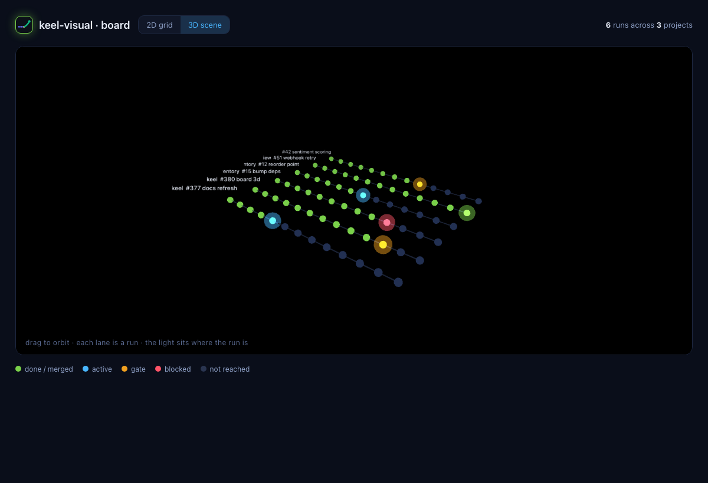

# keel-visual

An **optional** animated run visualizer for [keel](../README.md). It *renders* a
keel run — it never drives one. keel-visual depends on keel core; core never
depends on keel-visual, so installing it is purely additive.

> Think of it as `keel`'s window: the same ship_run records keel already writes,
> shown as a "where are we" animation — in your terminal or as a web page.

## Two surfaces, one source of truth

Both outputs are fed by a single **pure** adapter,
`runstate.build_run_state(record, …)`, which projects a keel run onto its
**command flow** — the canonical phase list each command has in keel core
(`keel.flows.flow_for`). No parallel data model, no second source of truth.

## Watching a run (the observer model)

keel-visual is a **separate observer**. It only ever *reads* the ledger and
checkpoint that `keel ship` already writes — it never drives the run and is never
in its call path. So it works **the same no matter how the run is launched**: by
hand, from an agent (Claude Code, Codex, …), or in CI. The run writes its
records; keel-visual reads them.

That means the visualizer is a **separate process you point at the same repo**,
not something the run prints itself. In particular:

- **The live animations need a real terminal (tty).** `play --follow` clears and
  redraws ANSI frames, and `--theater` hands the screen to `jury --theater` —
  both only animate in an interactive terminal. In **captured/agent/CI output**
  there is no live tty, so they **degrade gracefully**: `--theater` is skipped,
  `--color auto` drops colour, and a blocking `--follow` isn't how you'd consume
  it anyway. keel-visual never garbles a non-interactive stream.

So when **an agent (e.g. Claude Code) is driving `keel ship`**, you don't watch
the animation *inside* the agent's transcript — you watch it **alongside**, two
ways:

| want | run | needs a tty? |
| --- | --- | --- |
| **Watch live, in a terminal** | open your **own** terminal tab and run `keel-visual play --follow` (or `dash` for parallel runs) pointed at the same repo/worktrees. It reads the live checkpoint the agent's run writes, and the playhead moves as the run progresses. **Theater (`--theater`) triggers here, in your tty** — not in the agent's. | yes (your terminal) |
| **Watch in a browser** | `keel-visual render .keel/project.yaml --pr <N> --out run.html` writes a self-contained page — open it during or after the run, anywhere. | no |
| **A single frame / share** | `keel-visual play … --step <n>` or the web page screenshot. | no |

In short: *agent runs ship → you watch beside it* (a second terminal or the web
page), not *agent runs ship → animation in the agent's output*.

Two scope limits follow from "it reads the records":

- **One repo at a time.** `dash` and `--follow` watch a **single** keel project —
  `dash` enumerates that repo's worktrees via `git worktree list`, so it shows
  every parallel run *of that repo* on one board. It does **not** aggregate
  across separate repos: a parent folder that merely *contains* several projects
  isn't a git repo or a keel project, so point keel-visual at each project and
  run one instance per repo (a tab each). A cross-project board would be a
  separate feature.
- **Same machine / filesystem.** keel-visual reads the ledger and checkpoint
  **files** directly, so it sees a run only when those files land on the **same
  filesystem** it's reading. A run on *this* machine — your own `keel ship` or a
  **local** agent (Claude Code) — is visible; a run executing on a **different**
  machine (a remote/cloud session) writes its records *there*, so it won't appear
  in a local keel-visual. Watch it from wherever the run actually writes.

## Every command, not just ship

`--command` accepts **all 16 keel commands** (ci-check, coverage, deps-audit,
flake-audit, implement, morning, overnight, pr-loop, regression, review-all-day,
review-cycle, ship, stale-prs, triage, work-block, wrap). Each renders its own
flow — e.g. `overnight` shows `config → preflight → queue → work-block loop →
report`; `triage` shows `find → tier → classify → rank → apply → summary`.

`ship` is the full s0–s12 backbone with live merge/test-gate and regression
detail. The other commands render their phase structure (animatable via
`--step`/`play`); live `--follow`/`dash` position stays accurate for the
checkpoint-writing commands (ship / work-block / overnight).

### Parallel runs — `keel-visual dash`

Running 2-3 `keel ship` (or other) commands at once? Each runs in its own git
worktree with its own `.keel/state/`, so `dash` discovers them all via
`git worktree list` and shows one live board:

```
keel-visual dash .keel/project.yaml          # live board of every active run
keel-visual dash .keel/project.yaml --once   # one snapshot
```

```
keel · 3 active runs
  #351  ████████░░░░  s8  test     gate
  #352  ██████████░░  s10 merge    gate
  #360  ████████████  s12 close    merged
```

A worktree with no live checkpoint is skipped; all per-run reads are fail-soft so
one bad run never blanks the board. See
[`screenshots/dash-board.png`](screenshots/dash-board.png).

#### Across every project — `dash --all`

Work across **several** keel projects? `dash --all` aggregates them into one
board. Point `--root` at the parent folder; it scans the **immediate**
subdirectories for keel projects (a dir with both `.git` and
`.keel/project.yaml`), loads each project's own config, and groups the runs by
project:

```
keel-visual dash --all --root ~/code        # every keel project under ~/code
keel-visual dash --all                       # … under the current folder
```

```
keel · 3 runs across 2 projects
  alpha          #42  ████████░░░░  s8  test     gate
  beta           #12  ██████████░░  s10 merge    gate
  beta           #15  ███░░░░░░░░░  s3  guard
```

Fail-soft and one level deep: a subdir that isn't a git repo, has no keel config,
or has a malformed one is skipped — it never blanks the board. The
[same-filesystem limit](#watching-a-run-the-observer-model) still holds: this is
**every project on this machine**, not remote/cloud runs.

The same board as a **web page** — `render --all` writes a self-contained HTML
grid of run cards (project · #PR · a colour-coded step strip · status, with the
s7 jury surfaced), no tty needed:

```
keel-visual render --all --root ~/code --out board.html && open board.html
```



#### Live web dashboard — `keel-visual serve`

`render --all` writes a **static snapshot** — a run that starts afterwards won't
appear. `serve` is the **live** web dashboard: a tiny localhost server whose page
polls a `/board.json` endpoint that re-reads the records every ~0.5s, so the board
updates itself. Open it on the side and watch runs appear and advance; click a run
for a closable right-side **detail drawer** (its step flow + metadata; full-screen
on mobile).

```
keel-visual serve --all --root ~/code        # http://127.0.0.1:8765 — Ctrl-C to stop
```

Localhost-only by default (`--host` / `--port` to change). It's the web counterpart
of the live terminal `dash --all`.

The web board has a **2D grid / 3D scene** toggle in its header (or open with
`board.html?mode=3d`). The 3D scene packs every run into one perspective view —
one lane per run, a sphere per step coloured the same way as the grid (green
done/merged · cyan active · amber gate · red blocked · dim not-reached), the
active node glowing where the run currently sits, each lane labelled
`project #PR`. Drag to orbit; it auto-rotates otherwise. It needs Three.js from
a CDN, so the 3D view (only) wants network; the 2D grid stays fully offline.

Both views follow your **system light/dark theme** automatically
(`prefers-color-scheme`) — the grid re-themes live, and the 3D scene picks up the
theme on load (it reloads to re-theme if you flip the system theme while it's
open). The screenshots above are the dark theme.

Finished (merged) runs don't drop off the board — keel-visual only observes, so
a run stays while its worktree + checkpoint exist. To keep active work in focus,
finished runs are **sorted last and faded**, and an **`all` / `active`** filter
in the header (or `?filter=active`) hides them entirely — in both the 2D grid and
the 3D scene. Nothing is removed from disk; it's purely a view filter.

**Not just `ship`.** The board reads ship checkpoints *and* the additive
`.keel/activity/` records (the `keel activity` channel in keel core ≥ 1.6.0).
Commands that don't write a ship checkpoint — `triage`, `morning`, `pr-loop` … —
stamp their active phase as they run, so they appear live too, each with its own
`keel.flows` phases and its command in the footer. (Short one-shots that never
stamp simply don't show — render any command on its own with
`play --command <name>`.)



### 1. Terminal — `keel-visual play` (runs in the CLI)

The flow animates right in the terminal while a command runs:

```
keel-visual play .keel/project.yaml --pr 361              # animate the run once
keel-visual play .keel/project.yaml --pr 361 --loop       # replay continuously (demo / wall display)
keel-visual play .keel/project.yaml --follow              # LIVE: show where the run is right now
keel-visual play .keel/project.yaml --pr 361 --style wave # sine "ribbon" with a light trail
keel-visual play .keel/project.yaml --pr 361 --step 8     # a single frame (e.g. the test gate)
```

- `flow` — a pipeline of `s0…s12` with a playhead, gate colours (amber gate,
  red when blocked), a regression bar, and a "where are we" pointer.
- `wave` — the run drawn on a sine ribbon with a light trail up to the active
  step (the terminal's take on the 3D `line` style).
- **`--follow`** — live mode: every `--interval` seconds it re-reads the run's
  ledger + checkpoint (`position.current_step` *and* the `state` block, so merge
  progress *and the live jury status* show — pending / merged / failed, jury
  off / advisory / gating — not just position) and redraws where the run
  *actually* is now. Point it at a running keel command and watch the playhead
  move in real time. Ctrl-C to stop.
- **`--loop`** — replay the animation continuously (demo / always-on display).
- **`--theater`** — with `--follow` on a tty: hand the screen to ai-jury's
  `jury --theater` at the review step when the jury is active, then resume (see
  [With ai-jury](#with-ai-jury--theater-mode)).

`render` and `play` both pick up the live checkpoint automatically when you
don't pass `--checkpoint-step`. Colour is `--color auto` (only on a tty),
`always`, or `never`. See
[`screenshots/keel-visual-play.gif`](screenshots/keel-visual-play.gif) for the
animation in motion.

### 2. Web — `keel-visual render` (the alternative)

The same run as a single self-contained HTML page with a **2D flow** view and a
**3D scene** (Three.js): the light runs to where the run is, gates glow, the
cross-vendor jury orbits the review step, and reaching merge turns everything
green.

```
keel-visual render .keel/project.yaml --pr 361 --out keel-run.html
open keel-run.html
```

The page reads its run-state from `window.KEEL_RUN`, and honours
`?mode=2d|3d`, `?step=N`, `?play=1`, and `?s3d=<style>` URL params.

#### Selectable 3D styles

The 3D view offers a **style selector** (top-left of the scene). All styles share
one run-semantics layer — progress colours, the s7 jury, the light running to the
head, merged→green — and differ only in how the run is drawn:

| style | look | how it reads the run |
| --- | --- | --- |
| `plexus` *(default)* | an interweaving web of drifting points + fading links | the web breathes; nodes track each step, colours follow progress |
| `comet` | three interweaving particle streams with fading tails | streams flow to the running head, then dissolve |
| `aurora` | interweaving translucent ribbons with a soft fade | a wash that fades past the head |
| `combined` | the `plexus` web **and** the `comet` streams together | the richest variant |
| `line` | the original flowing-light ribbon | a single tube; the light runs along it |

**Configure the style two ways:**

- **In the page** — click `plexus · comet · aurora · combo · line` in the
  selector at the top-left of the 3D scene.
- **By URL** — append `?mode=3d&s3d=<style>` (e.g.
  `keel-run.html?mode=3d&s3d=combined`). Unknown values fall back to `plexus`.
  This is also how the screenshot harness pins a style.

Every style honours the same [colour language](#colour-language); switching
styles never changes what a colour means, only the geometry it is painted on.

> The 3D views (both `render` and the `render --all` board) load Three.js from
> cdnjs with a **Subresource Integrity** hash + `crossorigin`, so the browser
> refuses the script if the CDN ever serves altered bytes. The 2D views never
> touch the network.

## Colour language

| colour | meaning |
| --- | --- |
| green | step done · gate passed · merged (run is green) |
| cyan | the active step (where the run is) |
| amber | a gate being evaluated · regression `major` |
| yellow | regression `minor` finding |
| red | a blocked gate · regression `critical` finding |
| dim | a step the run has not reached yet |

## With ai-jury — theater mode

keel runs an optional **cross-vendor jury** on the review step (s7) — when
[ai-jury](https://github.com/berkayturanci/ai-jury) is installed and the run is
tier-3 or `--jury` is passed. ai-jury can render that deliberation as an animated
**theater** (`jury --theater`). keel-visual composes with it three ways — all of
them **fail-soft and dependency-free**: keel-visual never imports ai-jury, and if
the `jury` CLI is absent, the jury simply doesn't animate and nothing errors.

| # | combination | how |
| --- | --- | --- |
| **Live jury** | the run visual shows the jury **live** | `keel-visual play --follow` — the jury status (off / advisory / gating) is read from the live checkpoint at the review step, not just after the run. |
| **Theater handoff** | one screen, full flow | `keel-visual play --follow --theater` — when the live run reaches s7 with the jury active, the follower hands the terminal to `jury --theater`, then **resumes from the live checkpoint** (no position lost). One-shot per run; silently skipped if the `jury` CLI is absent, output is piped, or no PR resolves. |
| **Two panes** | side by side, zero coupling | run `keel-visual play --follow` in one pane and `jury --pr <N> --theater` in another. Both are pure side channels; neither touches keel's gate. |

```
keel-visual play .keel/project.yaml --follow            # live run + live jury status
keel-visual play .keel/project.yaml --follow --theater  # + hand off to jury theater at s7
```

ai-jury's theater has two looks — the default **flat** ANSI scene and a
**pixel-art** deliberation room (`--theater-style pixel`, truecolor terminal).
The handoff runs ai-jury with its own configured style, so set
`theater_style = "pixel"` in `jury.toml` for the pixel room (or pass
`--theater-style pixel` to `jury` directly in the two-pane mode).

> The jury **gate** (keel's s8 `jury` built-in) always runs deterministically and
> machine-readable — theater is a **human side channel** that never changes the
> gate's verdict, the report, or CI. keel core stays neutral and tty-free; all
> theater orchestration lives here in keel-visual.

## Install

keel-visual needs **keel core ≥ 1.6.0** (it reads `keel.flows`, the ledger, and
the checkpoint). Both packages are on PyPI — [`keel-visual`](https://pypi.org/project/keel-visual/)
pulls in [`keel-workflow`](https://pypi.org/project/keel-workflow/) automatically:

```
pipx install keel-visual    # or: pip install keel-visual
keel-visual --help
```

To run the latest unreleased features (or to develop), install from this repo —
installing the repo's core first guarantees a matching version:

```
# from the repo root
pip install -e ./ -e ./keel-visual   # editable: core + companion
keel-visual --help
```

See [`RELEASING.md`](RELEASING.md) for building and publishing keel-visual.

## Develop

```
python -m pytest                       # or: python -m unittest discover -s tests -t .
python -m coverage run --branch --source=keel_visual -m unittest discover -s tests -t .
python -m coverage report --fail-under=100 --omit="*/templates/*"
ruff check src/keel_visual tests
```

The Python core (`runstate`, `render`, `terminal`, the CLI's pure paths) is held
to **100% line + branch coverage**, matching keel core's bar. The HTML/JS
template is excluded from coverage (it is exercised by the screenshot harness).

## Screenshots

See [`screenshots/`](screenshots/): `terminal-cli.png` (the `play` output),
`2d-s8-test.png` (a blocked test gate), `3d-s6-run.png` (the default `plexus` 3D
style mid-run), `3d-styles.png` (the `combined` style with the style selector and
the s7 jury), `3d-s10-merge.png` (the `line` style, merged and all-green),
`2d-s12-merged.png` (a merged, all-green 2D run), `board.png` (the
`render --all` multi-project web board, 2D grid), and `board-3d.png` (the same
board's 3D scene — one lane per run).
