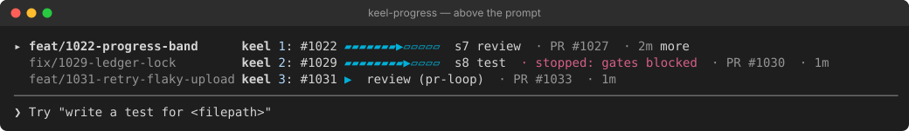
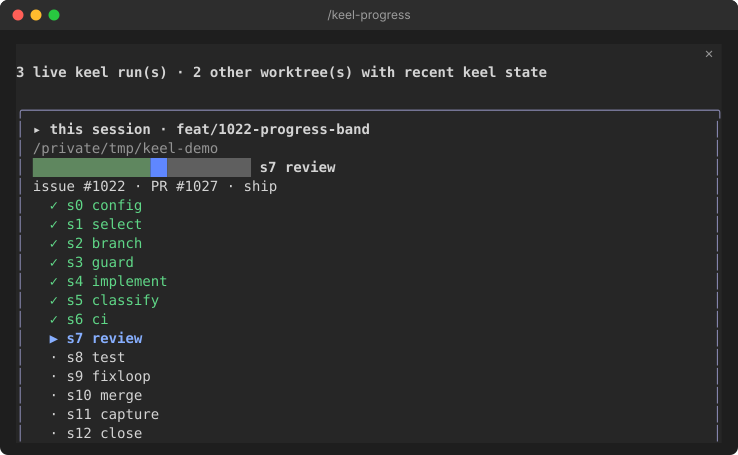

# keel-progress

An optional [Claude Code mod](https://code.claude.com/docs/en/plugins/mods/overview) that
shows this repository's live keel runs inside Claude Code, so you don't need a second
terminal running `keel-visual dash`.





Both are captures of Claude Code 2.1.288 running the mod over three demo runs, rendered as SVG.
The pane shows the run as a card too: the same step bar, then every step with its state.

- **Whose runs:** a session shows its own keel runs only: the ones in its folder and in the
  worktrees keel made under it (keel ship puts a run's worktree inside the session's checkout).
  Other sessions' runs are neither shown nor read. Turn on "Show other sessions' runs" in
  `/config` to see every recently active worktree of the repository.
- **Above the prompt:** a rounded card with one row per live run (`active`, `waiting` or
  `interrupted`). Each row shows the issue, the backbone as a segmented bar of chips (done green,
  the current step blue, or red where the run stopped, the rest grey), the current step, why it
  is held as a chip (amber while waiting, red when stopped), the pull request (a link to it on GitHub), and how long since
  keel last wrote. With more than one run each row starts with its worktree's branch, as wide as
  the longest one shown, within what the band can spare. The bar takes two cells per step on a
  band of 120 columns or more, one from 80, and is left out below that; the issue and the step
  name are never cut. The card adds two rows of border to the band: one run takes three rows.
  Text uses your terminal's own colors.
  The session's own run is first, marked `▸` and drawn bright. Nothing is drawn when no run
  is live.
  - **Click a run's issue** to open the pane on that run. There is no digit hotkey: a passive
    band must not take the first key of a prompt.
  - **`more` / `less`** lists every run, not just the first three, each with a second line
    holding the whole branch name and the worktree path.
- **`/keel-progress`:** opens a pane on one run: its whole branch name and worktree, every
  step, the history counts (shipped, blocked, deferred, skipped) and the next queued issue.
  The other live runs are listed below it as buttons to switch to, with **Refresh** and
  **Close**. A worktree whose `keel status` fails is listed in the pane with its error and
  left out of the band until a read succeeds again.

- **How fresh it is:** each line ends with how long ago keel last wrote anything for that run
  (`· 4m`). A live run nothing has been written for in 45 minutes reads `· quiet 1h`, in the
  waiting colour, so a stuck run stands out.
- **The pane's details:** links to the pull request and the issue (when the repository is on
  GitHub), when and where keel last wrote (checkpoint or activity record), and the checkpoint's
  last gate, review and check.
- **Notifications:** a toast when a run stops (`interrupted`, gates blocked), waits for you
  (`needs-input`), or leaves the board (merged, closed or finished). There are none for what
  was already there when the session opened. A short sound can go with them.

## Settings

Set these in `/config` (or with `/plugin configure keel-progress@keel`):

| Setting | Default | What it does |
| --- | --- | --- |
| Show other sessions' runs | off | Every recently active worktree of the repository, not only this session's own (a read per worktree). |
| Refresh every (seconds) | 2 | How often keel's state is read while a run is live; five times less often with none. `keel status` itself runs only when a checkpoint changed (or every 30 s), activity is read from its files |
| Runs above the prompt | 3 | How many runs the band shows before `+N more` |
| Notifications | on | Toasts for a stopped run, a run waiting for you, a run that left |
| Sound | off | A short sound with those toasts |

## How it reads the runs

Parallel `keel ship` runs each work in a worktree of their own. keel records a run in two
places, and the mod reads both:

- **the checkpoint** (`.keel/state/checkpoint.json`, or wherever the project's status contract
  says), written at keel's safe boundaries, read with `keel status --json`
- **the activity record** (`.keel/activity/<run-id>.json`), stamped at every phase a command
  passes through, read with `keel activity --json`. It is often newer than the checkpoint, and
  some runs never write a checkpoint at all.

For each run, whichever of the two was written last is shown. Activity from other commands
(`pr-loop`, `review-cycle`, …) shows too, with its phase name and command.

The mod always reads the session's own folder, then lists the repository's worktrees with
`git worktree list` and reads each other worktree whose checkpoint or activity changed in the
last 24 hours. A run is shown when:

- keel calls it live (`keel status`), or its activity record says `running` and was stamped
  in the last six hours (nothing marks an abandoned run done, so an older one is a run that
  stopped),
- it is the newest copy of its run: one run can leave checkpoints in several worktrees (a
  worktree nested in another), and only the most recently written one is shown; the pane
  counts the stale copies, and
- its pull request, if it has one, is still open (`gh pr list --state open`, read at most
  once a minute, and once more when a scan meets a PR the list doesn't hold; without `gh`
  nothing is hidden on these grounds)

The PR rule exists because `keel merge` used to leave a merged run's checkpoint at s10
(#1448), so old checkpoints read as waiting on the merge window. Outside a git repository,
or when `git` can't run, only the session's own folder is read. With no live run, the pane
still shows the session's project: no active run, its history counts and next issue.

It scans:

- once when the session starts
- every five seconds while a run is live (or this session's own `keel status` is failing),
  every 30 seconds when there is none
- right after any Bash call that runs `keel`

Only one scan runs at a time. A read asked for after a keel command, by the pane or
by **Refresh** starts once the running one ends, so it is taken after the command returned.
A keel command run in the background returns at once; the next poll picks up what it writes.

The step names come from the status contract (`keel.progress-status.v1`), so a renamed or
added step shows up without a mod release.

It follows the same rule as keel-visual: it **only reads**. It never writes the
checkpoint or ledger and never drives a run. So it shows any run in the repository's
worktrees, whether you, Claude Code or Codex started it.

## Install

Install keel itself first ([install guide](../../docs/keel/install.md)). You also need Claude Code **2.1.287 or newer**, with mods enabled for your account. If
`claude plugin test` prints `hooks modules are turned off in this process`, mods are off
for your account and no local setting turns them on.

```text
/plugin marketplace add berkayturanci/keel
/plugin install keel-progress@keel
```

Start Claude Code in the directory that holds `.keel/project.yaml`, and make sure `keel`
is on your `PATH`.

Other hosts are not affected. Only Claude Code's plugin loader reads this directory: the
`keel` plugin, the Python package, and the Codex, Cursor and Antigravity adapters don't
change.

## Develop

```bash
claude --plugin-dir mods/keel-progress   # loads it, hot-reloads on save
claude plugin validate mods/keel-progress
cd mods/keel-progress && claude plugin test
```

`hooks/view.js` is the pure projection from status JSON to what is drawn, and
`hooks/register.js` holds the hooks. The tests in `tests/` stub `git worktree list`,
`gh`, `keel status`, the checkpoint times and the clock.

## Limits

- It shows one repository: the one the session runs in. Runs in other repositories need a
  session there.
- A worktree whose `keel status` fails is listed in the pane and left out of the band.
- It checks for `.keel/project.yaml` when the session starts. A project created later in
  the session (`keel init`) shows after `/reload-plugins` or a new session.
- A run in another worktree left behind without a pull request keeps showing for 24 hours
  after its checkpoint last changed.
- While no run is live it scans every 30 seconds, so a run started from another terminal
  (or by Codex) can take that long to appear. A keel command in this session scans at once.
